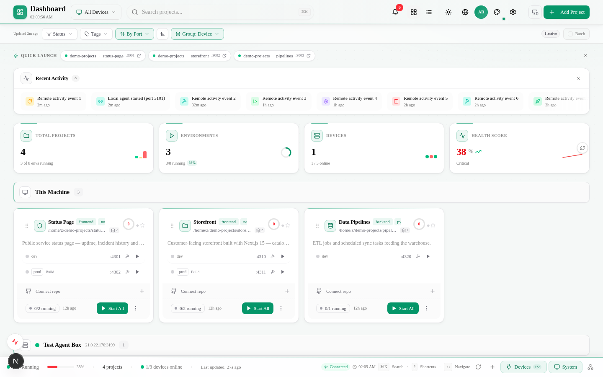
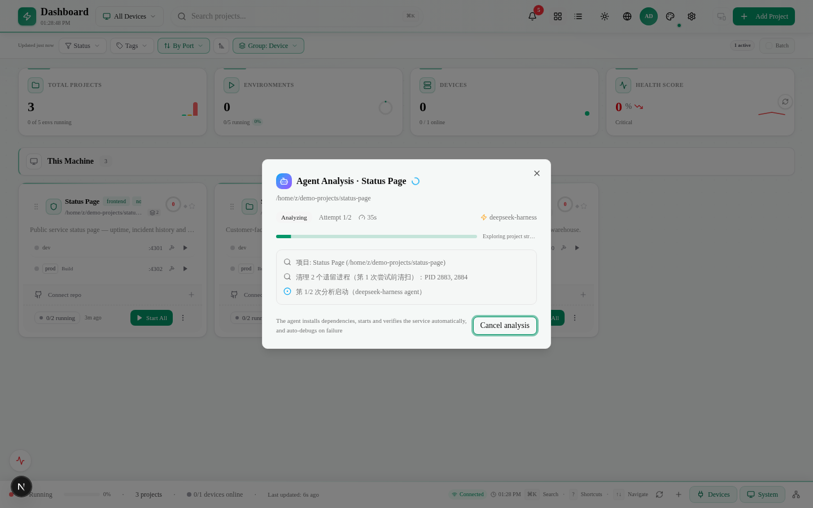
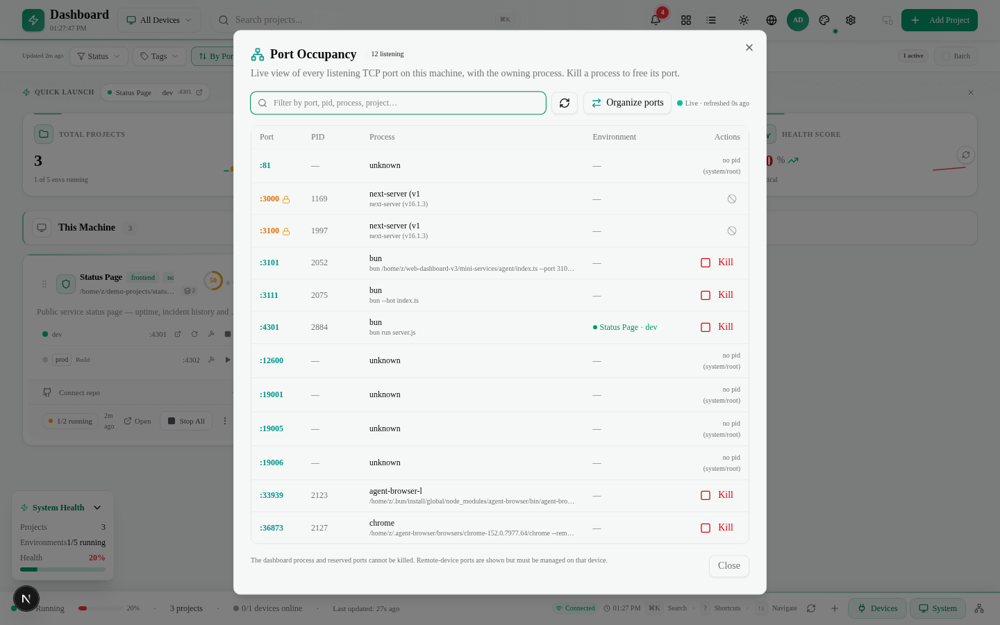
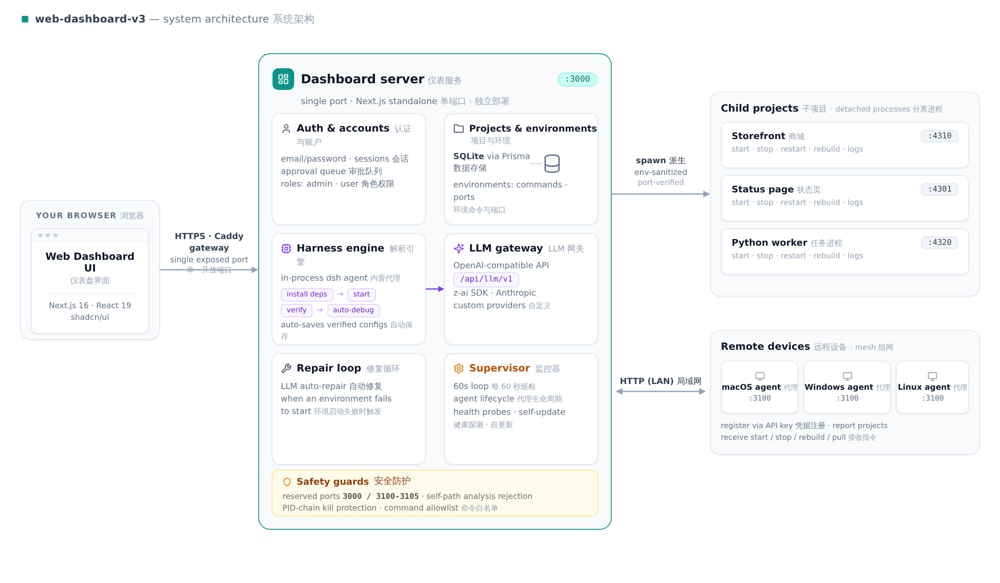

<div align="center">

# Web Dashboard

**A self-hosted control panel for the projects running on all your machines.**

[](LICENSE)
[](https://nextjs.org)
[](https://bun.sh)
[](https://prisma.io)

[English](README.md) · [简体中文](README.zh-CN.md)

</div>

---

Point it at a directory, and the dashboard figures out how the project starts — install, launch, verify — then gives you one page to start, stop, restart, rebuild, pull, or branch-switch any environment on any machine in your house. It runs entirely on your own hardware: one SQLite file, one port, no cloud dependency.



## How it works

When you add a project, an in-process agent (deepseek-harness) walks the directory, installs whatever is missing, picks free ports, starts the dev server, polls it until it answers, debugs it if it doesn't, and only then saves the configuration. Both a `dev` and a `production` entry come out verified, with the commands and env vars recorded as-is — you can edit them afterwards like any normal field.



Everything the agent learned is applied server-side the moment analysis finishes, so closing the wizard or losing the tab never throws the result away.

The same loop protects day-to-day operations: environment starts are verified against the actual port (not a two-second guess), failures feed an LLM repair loop with the log tail attached, and the supervisor re-checks every 60 seconds.

## Features

**Projects & environments**
- Multiple environments per project (`dev`, `production`, custom), each one command + one port
- Start / stop / restart / rebuild from the card, the context menu, or the detail page
- Live status from real TCP port probes, PID tracking, streamed logs
- Drag to reorder, pin, tag, ⌘K search, card and list views

**GitHub integration**
- One-click pull on the card (missing `origin` remotes are auto-completed)
- Branch switcher with local + remote branches, checkout and pull in one action
- Version badges: branch @ commit, commit age, dirty-tree indicator
- Remote update checks every 10 minutes with a summary notification for stale projects

**Multiple machines**
- Small agents for Windows / macOS / Linux register over the LAN and mirror their project lists back to the dashboard
- Remote projects support the same operations as local ones — start, stop, rebuild, logs, edit
- Agents self-update: after you `git pull` on one machine, the others follow and restart themselves
- Works behind one-way firewalls via 60-second heartbeats

**Port hygiene**
- Live port occupancy panel with owning process and PID
- One-click "organize ports": dev from 3001 up, prod = dev + 1000, system ports avoided, existing compliant assignments untouched — with a preview before anything changes



**Reliability**
- Auto-repair loop for failed starts (LLM-assisted, log tail in context)
- Supervisor checks agent health, database migrations, and dashboard self-updates every 60 s
- Safety rails throughout — see [Safety](#safety)

## Architecture

One Next.js process. The agents you deploy elsewhere are the only other moving parts.



| Path | What it is |
|---|---|
| `src/app/` | Dashboard page and REST API (App Router) |
| `src/lib/` | Process manager, harness engine, device mesh, sync, safety guards |
| `prisma/` | Schema (SQLite) |
| `mini-services/agent-*` | Device agents for Windows / macOS / Linux |
| `start-dashboard.bat`, `start-agent.bat` | One-click scripts for Windows |

Stack: Next.js 16, React 19, TypeScript, Prisma + SQLite, Tailwind CSS, shadcn/ui, running on Bun.

## Quick start

### macOS / Linux

```bash
git clone https://github.com/Jing0715-fer/web-dashboard-v3.git
cd web-dashboard-v3
bun install
cp .env.example .env        # defaults are fine
bun run db:push
bun run dev
```

Open http://localhost:3000 and sign in with the bootstrap account:

```
admin@dashboard.local / admin123456
```

Change the password on first login (Account menu → Change password), or set `ADMIN_EMAIL` / `ADMIN_PASSWORD` in `.env` before the first start.

### Windows (one click)

```bat
git clone https://github.com/Jing0715-fer/web-dashboard-v3.git
cd web-dashboard-v3
start-dashboard.bat
```

The script installs dependencies (bun not required), writes `.env`, initializes the database, and starts the server. Re-running it is cheap: when everything is already installed it starts in seconds.

The only required setting is `DATABASE_URL` — where the SQLite file lives. Keep the default `file:../db/custom.db` (resolves to `db/custom.db` at the repo root); if you customize it, prefer an absolute path with forward slashes.

## Adding a second machine

Run the agent on the other machine from the repo root:

```bash
./start-agent.sh 3101          # macOS / Linux
start-agent.bat 3101           # Windows
```

Then on the dashboard: **Devices → Join network**, enter the peer address (e.g. `http://192.168.1.43:3000`), and confirm the pairing code. Pairing is bidirectional — both machines see each other's projects, and address or key changes heal themselves. After that, `git pull` on the dashboard machine is the only maintenance; the agents follow automatically.

Inbound-blocked firewalls are fine: agents push their project data out via heartbeat, and the device card gets a "push" badge so the situation is visible.

## Daily use

| Task | How |
|---|---|
| Add a project | "Add Project" → path → the agent analyzes and proposes environments (editable afterwards) |
| Start / stop | ▶ / ■ on the environment row, card menu, or detail page |
| Attach a GitHub link | Detail page → GitHub URL field (synced to every machine automatically) |
| Pull latest code | Pull button on the card — works for remote projects too |
| Switch branch | Card menu → "Switch branch…" |
| Organize ports | Ports panel → "Organize ports" → preview → apply |
| Read logs / status | Detail page: live logs, versions, activity |
| Add an environment | Detail page → Environments → Add |

## Configuration

| Variable | Default | Purpose |
|---|---|---|
| `DATABASE_URL` | `file:../db/custom.db` | SQLite location (required) |
| `ADMIN_EMAIL` | `admin@dashboard.local` | Bootstrap admin account |
| `ADMIN_PASSWORD` | `admin123456` | Bootstrap admin password |
| `RESERVED_PORTS` | *(empty)* | Extra ports the dashboard refuses to kill or assign, comma-separated |
| `START_VERIFY_TIMEOUT_MS` | `45000` | How long an environment start waits for its port before failing |

LLM providers are configured in-app (System → LLM settings): the built-in gateway speaks the OpenAI-compatible protocol on `/api/llm/v1` and wraps the bundled SDK, an Anthropic endpoint, or any custom OpenAI-compatible base URL. Analysis runs through this gateway, so no project code leaves your network unless you point it at an external provider.

## Safety

Managing processes is the whole point of this tool, so the guards are part of the feature set, not an afterthought:

- **Reserved ports** — the dashboard's own port (`3000` by default) and the agent range (`3100–3105`) can never be assigned to a project or killed from the UI.
- **Self-path rejection** — registering or analyzing the dashboard's *own* directory is refused with a clear error. Before this guard, the analysis agent's pre-flight cleanup would read the dashboard's live `.next/dev/lock` and kill the running server — the dashboard stopped itself mid-analysis. The rejection now sits at four layers (project create, harness API, engine entry, spawn).
- **PID-chain protection** — the dashboard's own process tree can never be a kill target, neither directly nor via stray-listener sweeps before start.
- **Command allowlist** — environment commands are validated against a known-safe prefix list; `rm -rf`, pipe-to-shell, and friends never reach `spawn`.
- **Isolated child env** — spawned projects inherit a sanitized environment: the dashboard's own `DATABASE_URL`, `__NEXT_PRIVATE_*` and `TURBOPACK` variables are stripped so children can't accidentally open the dashboard's database.

## Troubleshooting

| Symptom | Cause and fix |
|---|---|
| Adding a project fails with "it contains the dashboard itself" | Intentional. Analyzing the dashboard's own directory used to stop the service (the agent killed the live dev server via its `.next/dev/lock`). Register a copy of the project in a different directory instead. |
| Remote analysis ("Add remote project") fails with "Not found" | The agent on the target device predates the analysis endpoint (TS agents before v1.14, older downloaded packages). The dialog names the running version — update the agent on that machine (`git pull` in the project directory + restart the agent, or re-download the package from the Devices panel) and retry. |
| Device shows "online" but 0 projects, while that machine sees its own projects | The agent on that machine can't find the co-located dashboard database (`DATABASE_URL` in a non-default location). `git pull` and restart the agent (v1.12+ auto-detects custom locations); the device card names the problem. |
| "Agent too old" on pull / one machine can't see the other's projects | The machine pulled new code but didn't restart the agent (git can't hot-swap a running process). The amber badge on the device card says which one. Restart the agent. |
| Remote edit returns 401 | Key rotation after an agent reinstall. Modern versions re-authenticate automatically; if it persists, pair once more. |
| Duplicate device rows | They self-merge within minutes. When adding devices manually, use the agent's real apiKey. |
| Start fails with "process exited immediately" | The command doesn't exist on that machine (PATH). The error includes the exit code and log path — write the command with absolute paths. |
| Startup fails on `package.json` conflict markers | `git checkout origin/main -- package.json` and restart; commit or stash local changes before pulling. |

## Updating

```bash
git pull
bun run dev        # re-installs deps and migrates the database if needed
```

Windows uses `start-dashboard.bat` (detects dependency changes automatically). Agents on other machines update themselves — no per-machine maintenance.

## License

[MIT](LICENSE)
